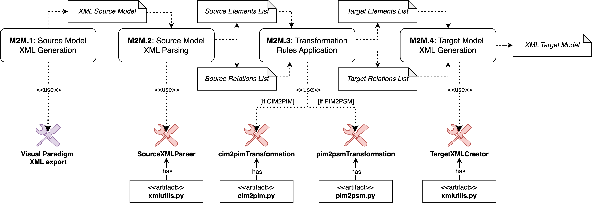

# MoDT-M2M-TT:  Mobility Digital Twin Model-to-Model Transformation Tool


**MoDT-M2M-TT** is the *Mobility Digital Twin Model-To-Model Transformation Tool* used in the *Model-Driven 
Architecture* (MDA) approach for developing *Mobility Digital Twins* (MoDT). It automates **Model-to-Model (M2M) 
transformations**, specifically transforming models from the *Computational Independent Model* (CIM) to the 
*Platform Independent Model* (PIM), and from the *PIM* to the *Platform Specific Model* (PSM).

The MoDT-M2M-TT process, illustrated in Figure 1, comprises four distinct steps represented by rounded boxes. Each 
step produces an output, indicated by notes in the diagram, serving as input for the subsequent step.

<div align="center">
  
  <p><b>Figure 1:</b> MoDT-M2M-TT Transformation Process. </p>
</div>

The process begins with step *M2M.1*, where the source model is converted into the eXtensible Markup Language (XML) format 
using the [**Visual Paradigm**](https://www.visual-paradigm.com/) modeling tool. 
In step *M2M.2*, the custom-built **SourceXMLParser** tool, located in [*xmlutils.py*](https://raw.githubusercontent.com/alessandrasomma28/MoDT-M2M-TT/refs/heads/main/TransformationRules/xmlutils.py), 
processes the XML source model. It extracts the elements and relationships of the imported UML Class Diagram for 
subsequent transformation.

Step *M2M.3* applies transformation rules to convert the extracted source elements and relationships into their  
corresponding target elements and relationships. If the transformation being performed is **CIM-to-PIM**, 
the **cim2pimtransformation** tool (located in [*cim2pim.py*](https://raw.githubusercontent.com/alessandrasomma28/MoDT-M2M-TT/refs/heads/main/TransformationRules/CIM2PIM/cim2pim.py)) is used. 
For **PIM-to-PSM** transformations, the **pim2psmtransformation** tool (located in [*pim2psm.py*](https://raw.githubusercontent.com/alessandrasomma28/MoDT-M2M-TT/refs/heads/main/TransformationRules/PIM2PSM/pim2psm.py)) is utilized.

Finally, in step *M2M.4*, the target elements and relationships are organized into the XML format 
using the **TargetXMLCreator** tool, also available in [*xmlutils.py*](https://raw.githubusercontent.com/alessandrasomma28/MoDT-M2M-TT/refs/heads/main/TransformationRules/xmlutils.py). 
This XML output enables import into Visual Paradigm or other modeling tools for visualizing the resulting class diagrams.


## MoDT-M2M-TT Repository structure

## MoDT-M2M-TT Tool Execution
The *MoDT-M2M-TT* tool is executed by running the `main.py` script. It can be run via the command line or any IDE 
that supports Python execution. 

### Prerequisites 
Before running `main.py`, a Python Virtual Environment must be activated. The environment can be created using the 
provided **requirements.txt** file. 

Moreover, to properly execute the *MoDT-M2M-TT* tool, the starting domain model (the CIM) must be exported in XML 
format and placed in the following directory:

> *path/to/repository/MoDT-M2M-TT/MDAModelinLevels/01.CIM/VP_GENERATED_XML*

If the directory path is modified, the constant **CIM_VP_XML_FILE_PATH**, located in [**constants.py**](https://raw.githubusercontent.com/alessandrasomma28/MoDT-M2M-TT/refs/heads/main/TransformationRules/constants.py), 
must be updated accordingly. 

For ensuring replicability, an existing UML class diagram representing the *Bologna Mobility Domain Model* is already 
available in XML format.

### Setup Instructions for Execution from Command Line
1. Clone the repository to your local machine:
     ```bash
   git clone repository-url
2. Navigate to the repository directory
    ```bash
   cd /path/to/repository
3. Create and activate a virtual environment
   1. If virtualenv is not installed in your local machine, install it by running:
   ```bash
   python3 -m pip install virtualenv
   ```
   2. Create a Python virtual environment:
   ```bash
   virtualenv venv
   ```
   3. Activate the virtual environment:
   ```bash
   source venv/bin/activate
   ```
4. Once the Python virtual environment has been created and activated, install the required Python packages using 
   the **requirements.txt**:
    ```bash
   pip3 install -r requirements.txt
   ```
5. Run the `main.py` script:
   ```bash
   python3 main.py
   ```

### Setup Instructions for Execution from IDE
1. Open the project in your preferred IDE (e.g., PyCharm, VSCode, etc.).
2. Ensure the Python interpreter for the project is set to the virtual environment created in the setup process 
   and that the required packages are installed.
3. Run the `main.py` script within the IDE.


